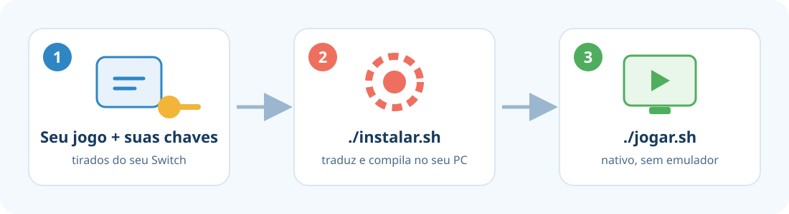

<p align="center">
  
</p>

# Tomodachi LTD Recomp

Jogue **Tomodachi Life: Living the Dream** como um **programa nativo do seu PC**, sem rodar um emulador por trás.

O projeto **não contém o jogo**. Você usa a **sua própria cópia**, e o instalador transforma o código dela, no seu computador, em um programa que roda direto no PC.

> [!WARNING]
> **Projeto educacional e experimental.** Use só com uma cópia do jogo que **você comprou** e extraiu do **seu próprio Switch**.
> Este projeto não tem ligação com a Nintendo, não distribui nenhum arquivo do jogo e não ajuda a obter jogos ou chaves por outros meios.
> Leia o [aviso legal completo](LEGAL.md).

<p align="center">
  
</p>

---

## O que você precisa

| | |
|---|---|
| 🖥️ **Sistema** | Linux. Testado no **Arch Linux / EndeavourOS**. A versão para Windows ainda está em desenvolvimento. |
| 🧠 **Memória** | **16 GB de RAM** e pelo menos **8 GB de swap** (memória virtual) |
| 💾 **Espaço livre** | **35 GB** |
| 🎮 **Placa de vídeo** | Qualquer uma com **Vulkan** (NVIDIA, AMD ou Intel recentes) |
| 📦 **Seu jogo** | O arquivo **`.nsp`** do Tomodachi Life: Living the Dream, **versão 1.0.0, sem atualização** |
| 🔑 **Suas chaves** | O arquivo **`prod.keys`** do seu console |

> O jogo e as chaves precisam ser extraídos do **seu** Switch, com ferramentas próprias para isso. Este projeto não fornece esses arquivos.

---

## Passo 1 — Preparar o computador

Abra o **Terminal**, cole o comando abaixo e aperte **Enter**. Ele vai pedir a sua senha:

```bash
sudo pacman -S --needed base-devel git cmake ninja clang python python-cryptography qt6-base qt6-svg qt6-5compat qt6-charts quazip-qt6 sdl3 ffmpeg opus zstd lz4 libusb openssl boost glslang nasm vulkan-icd-loader zenity
```

Isso instala os programas usados para montar o jogo. Só precisa ser feito uma vez.

---

## Passo 2 — Baixar este projeto

No mesmo Terminal:

```bash
git clone https://github.com/RussoPhone/tomodachi-ltd-recomp.git
cd tomodachi-ltd-recomp
```

> Se preferir, clique no botão verde **Code → Download ZIP** aqui no GitHub, extraia a pasta e abra o Terminal dentro dela.

---

## Passo 3 — Instalar

```bash
./instalar.sh
```

1. Uma janela pede o **arquivo do jogo (`.nsp`)**. Escolha e clique em OK.
2. Outra janela pede a **pasta onde está o seu `prod.keys`**. Escolha e clique em OK.
3. O instalador faz o resto sozinho e mostra o andamento em **10 passos**.

⏱️ **Demora de 1 a 4 horas**, dependendo do computador. A maior parte é a compilação do jogo, e o PC vai ficar ocupado nesse tempo. Pode deixar rodando e voltar depois.

💡 **Precisou parar?** Feche o Terminal ou aperte `Ctrl+C`. Quando rodar `./instalar.sh` de novo, ele **continua de onde parou**.

Uma janela do emulador abre e fecha sozinha no passo 7. Isso é normal, não feche.

No final, ele pergunta se você quer um **atalho no menu de aplicativos**. Responda `S`.

---

## Passo 4 — Jogar 🎉

Procure **Tomodachi** no menu de aplicativos, ou rode no Terminal:

```bash
./jogar.sh
```

| Para… | Use |
|---|---|
| Tela cheia | `./jogar.sh --fullscreen` |
| Imagem mais nítida | `./jogar.sh --scale 2` (pode ser `1`, `1.5`, `2`, `3` ou `4`) |
| Configurar controles | Aperte **F12** dentro do jogo |

Depois de instalado, o jogo **não precisa mais do `.nsp` nem das chaves**. Tudo fica dentro da pasta do projeto.

---

## Perguntas frequentes

<details>
<summary><b>Deu erro durante a instalação. E agora?</b></summary>

O instalador mostra qual passo falhou e onde está o registro completo (pasta `local/logs/`). Os erros mais comuns:
- **"Faltam programas"**: rode de novo o comando do Passo 1.
- **"Versão diferente da suportada"**: seu jogo tem uma atualização ou é outra versão. Por enquanto só a 1.0.0 funciona.
- **Falta de memória**: confira se você tem os 8 GB de swap. O instalador já limita o uso de RAM, mas abaixo disso não dá.

Corrigiu? É só rodar `./instalar.sh` de novo.
</details>

<details>
<summary><b>Onde ficam meus saves?</b></summary>

Em `local/package/tomodachi/user/nand/user/save/`. Faça cópias dessa pasta de vez em quando.
</details>

<details>
<summary><b>Posso usar o computador durante a instalação?</b></summary>

Pode, mas ele vai estar lento, porque a compilação usa quase toda a memória e o processador. Evite atualizar o sistema (`pacman -Syu`) enquanto instala: trocar o compilador no meio obriga a compilar tudo de novo.
</details>

<details>
<summary><b>Funciona no Windows?</b></summary>

Ainda não. A versão para Windows (`.exe`) é o próximo objetivo do projeto.
</details>

<details>
<summary><b>Como desinstalar?</b></summary>

Apague a pasta `tomodachi-ltd-recomp` e o atalho em `~/.local/share/applications/tomodachi-native.desktop`.
</details>

<details>
<summary><b>Como isso funciona por dentro?</b></summary>

O jogo do Switch é feito para o processador ARM do console. O instalador:
1. Lê o código do **seu** jogo e **traduz cada trecho para a linguagem C** (recompilação estática), usando o [mk8-recomp](https://github.com/dougchansan/mk8-recomp), baseado no suyu.
2. **Compila** esse C para o processador do seu PC e junta tudo num executável próprio, **sem emulador de CPU**.
3. Gráficos (Vulkan), áudio e serviços do sistema ficam a cargo das bibliotecas do suyu, compiladas nativamente junto com o jogo.

Os ajustes que este projeto precisou fazer no suyu estão em [`patches/`](patches/), cada um com a explicação no próprio arquivo. O código C gerado é uma tradução da máquina. **Não é o código-fonte original do jogo.**
</details>

---

## Estado do projeto

🧪 **Experimental.** O jogo abre e roda com o código 100% nativo (sem JIT), com áudio e vídeo. Foram testados a abertura e o início do jogo. Pode haver bugs em partes que ainda não foram jogadas. Se encontrar algum, abra uma *issue* contando o que aconteceu.

## Créditos e licença

- [**mk8-recomp**](https://github.com/dougchansan/mk8-recomp) e o fork do **suyu**: o motor de recompilação e o ambiente de execução. O suyu é derivado do yuzu.
- Este projeto: o instalador, os patches e o suporte ao Tomodachi Life: Living the Dream.

Licenciado sob a **GPL-3.0-or-later** (veja [`LICENSE`](LICENSE)), a mesma do suyu.

*Tomodachi Life e Nintendo Switch são marcas registradas da Nintendo. Este projeto não tem relação com a Nintendo nem é endossado por ela.*
