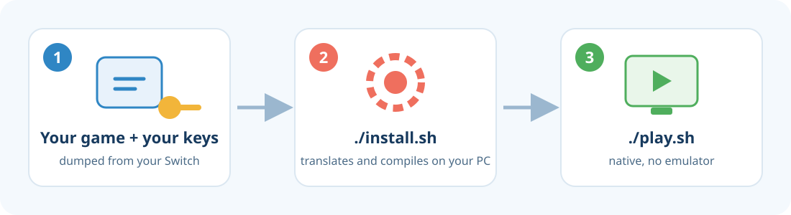

<p align="center">
  
</p>

# Tomodachi LTD Recomp

Play **Tomodachi Life: Living the Dream** as a **native program on your PC**, without an emulator running underneath.

This project **does not contain the game**. You bring **your own copy**, and the installer turns its code, on your own computer, into a program that runs directly on your PC.

🇧🇷 [Leia em português](README.pt-BR.md)

> [!WARNING]
> **Educational and experimental project.** Use it only with a copy of the game that **you bought** and dumped from **your own Switch**.
> This project is not affiliated with Nintendo, does not distribute any game files, and does not help anyone obtain games or keys any other way.
> Read the [full legal notice](LEGAL.md).

<p align="center">
  
</p>

---

## What you need

| | |
|---|---|
| 🖥️ **System** | **Linux**, tested on Arch Linux / EndeavourOS. **Windows 10/11**: experimental, see [Windows](#windows-experimental). |
| 🧠 **Memory** | **16 GB of RAM** and at least **8 GB of swap** (virtual memory) |
| 💾 **Free space** | **35 GB** |
| 🎮 **Graphics card** | Any with **Vulkan** (recent NVIDIA, AMD or Intel) |
| 📦 **Your game** | The **`.nsp`** file of Tomodachi Life: Living the Dream, **version 1.0.0, without updates** |
| 🔑 **Your keys** | The **`prod.keys`** file from your console |

> The game and the keys must be dumped from **your own** Switch with the tools made for that. This project does not provide them.

---

> 🪟 **On Windows?** Skip to [Windows (experimental)](#windows-experimental). Steps 1 to 4 below are for Linux.

## Step 1 — Prepare your computer

Open the **Terminal**, paste the command below and press **Enter**. It will ask for your password:

```bash
sudo pacman -S --needed base-devel git cmake ninja clang python python-cryptography qt6-base qt6-svg qt6-5compat qt6-charts quazip-qt6 sdl3 ffmpeg opus zstd lz4 libusb openssl glslang nasm vulkan-icd-loader zenity
```

This installs the programs used to build the game. You only need to do it once.

---

## Step 2 — Download this project

In the same Terminal:

```bash
git clone https://github.com/RussoPhone/tomodachi-ltd-recomp.git
cd tomodachi-ltd-recomp
```

> Prefer clicking? Use the green **Code → Download ZIP** button here on GitHub, extract the folder and open a Terminal inside it.

---

## Step 3 — Install

```bash
./install.sh
```

1. A window asks for your **game file (`.nsp`)**. Pick it and click OK.
2. Another window asks for **the folder that contains your `prod.keys`**. Pick it and click OK.
3. The installer does the rest by itself and shows its progress in **10 steps**.

⏱️ **It takes 1 to 4 hours**, depending on your computer. Most of that is compiling the game, and the PC will be busy meanwhile. You can leave it running and come back later.

💡 **Need to stop?** Close the Terminal or press `Ctrl+C`. Next time you run `./install.sh` it **picks up where it left off**.

During step 7 an emulator window opens and closes by itself. That is normal, don't close it.

At the end it asks whether you want a **shortcut in your applications menu**. Answer `Y`.

---

## Step 4 — Play 🎉

Look for **Tomodachi** in your applications menu, or run:

```bash
./play.sh
```

| To… | Use |
|---|---|
| Play fullscreen | `./play.sh --fullscreen` |
| Get a sharper image | `./play.sh --scale 2` (`1`, `1.5`, `2`, `3` or `4`) |
| Set up controls | Press **F12** in the game |

Once installed, the game **no longer needs the `.nsp` or the keys**. Everything lives inside the project folder.

---

## Windows (experimental)

> [!NOTE]
> The Windows installer is **new and not yet tested with the game on a real Windows PC**. An automatic check on GitHub builds the tools on Windows (steps 1–5 pass, about 45 minutes), but the full install still needs a first tester. If you try it, please open an [issue](https://github.com/RussoPhone/tomodachi-ltd-recomp/issues) with the result and the log from `local\logs\`. **Never attach your keys or game files.**

1. Click the green **Code → Download ZIP** button here on GitHub.
2. Extract it to a **short folder**, for example `C:\tomodachi`. Long paths can break the Windows build tools.
3. Double-click **`install.bat`**.
   - The first time, it installs the build tools with **winget**: Git, CMake, Ninja, Python, LLVM and the **Visual Studio 2022 Build Tools** (several GB). Windows asks for permission once.
   - Then it does the same 10 steps as on Linux. A window asks for your **`.nsp`**, another for the **folder with your `prod.keys`**.
   - It takes **2 to 4 hours**. If it stops, double-click `install.bat` again: it picks up where it left off.
4. To play, open **Tomodachi Life (native)** from the Start menu, or double-click **`play.bat`**. The same options work: `play.bat --fullscreen`, `play.bat --scale 2`.

You need the same as on Linux: 16 GB of RAM, about 35 GB of free space (plus ~10 GB for Visual Studio) and a Vulkan graphics card.

---

## FAQ

<details>
<summary><b>The installation failed. What now?</b></summary>

The installer tells you which step failed and where the full log is (the `local/logs/` folder). The most common causes:
- **"Missing software"**: run the command from Step 1 again. The message lists exactly what is missing.
- **"Different version than the supported one"**: your game has an update or is another version. Only 1.0.0 works for now.
- **Out of memory**: make sure you have the 8 GB of swap. The installer already limits RAM use, but it cannot go below that.

Fixed it? Just run `./install.sh` again.
</details>

<details>
<summary><b>Where are my saves?</b></summary>

In `local/package/tomodachi/user/nand/user/save/`. Back that folder up now and then.
</details>

<details>
<summary><b>Can I use my computer while it installs?</b></summary>

Yes, but it will be slow, because compiling uses almost all the memory and CPU. Avoid system updates (`pacman -Syu`) while installing: if the compiler changes in the middle, everything has to be compiled again.
</details>

<details>
<summary><b>The compile step is very slow (KDE Plasma)</b></summary>

KDE's file indexer (Baloo) tries to read the gigabytes of generated code and can take several GB of RAM, leaving less memory for compiling. Pause it while installing with `balooctl6 suspend`, and turn it back on afterwards with `balooctl6 resume`.
</details>

<details>
<summary><b>Does it work on Windows?</b></summary>

Experimentally. See [Windows (experimental)](#windows-experimental). It builds the `.exe` on your own PC, like on Linux, and still needs its first full test with the game.
</details>

<details>
<summary><b>How do I uninstall it?</b></summary>

Delete the `tomodachi-ltd-recomp` folder and the shortcut at `~/.local/share/applications/tomodachi-native.desktop`.
</details>

<details>
<summary><b>How does it work under the hood?</b></summary>

Switch games are built for the console's ARM processor. The installer:
1. Reads the code of **your** game and **translates every piece of it into C** (static recompilation), using [mk8-recomp](https://github.com/dougchansan/mk8-recomp), which is based on suyu.
2. **Compiles** that C for your PC's processor and links everything into one executable, **with no CPU emulator**.
3. Graphics (Vulkan), audio and system services come from suyu's libraries, compiled natively together with the game.

The fixes this project needed in suyu are in [`patches/`](patches/), each explained inside the file. The generated C is a machine translation. **It is not the game's original source code.**
</details>

---

## Project status

🧪 **Experimental — first public version.**

- ✅ The game boots and runs with **100% native code** (no JIT), with audio and video. The opening and the start of the game have been tested.
- ✅ The **installer was tested end to end on a fresh clone**: all 10 steps passed and the resulting game started. It took about **2 hours** on a laptop with an Intel i5-13450HX and 16 GB of RAM (about 9 minutes for suyu, the rest compiling the game).
- 🆕 It is still new, so it has only been run on that one machine. If a step fails for you, please open an [issue](https://github.com/RussoPhone/tomodachi-ltd-recomp/issues) and attach the log file the installer points to (in `local/logs/`). **Never attach your keys or game files.**
- 🐞 There may be bugs in parts of the game nobody has played yet. Report them the same way.

## Credits and license

- [**mk8-recomp**](https://github.com/dougchansan/mk8-recomp) and its **suyu** fork: the recompiler and runtime. suyu is derived from yuzu.
- This project: the installer, the patches and the Tomodachi Life: Living the Dream support.

Licensed under **GPL-3.0-or-later** (see [`LICENSE`](LICENSE)), the same as suyu.

*Tomodachi Life and Nintendo Switch are trademarks of Nintendo. This project is not affiliated with or endorsed by Nintendo.*
