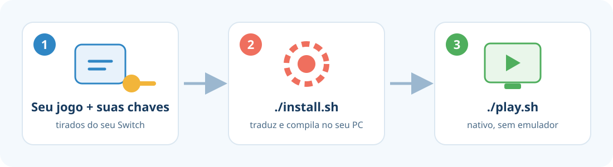

<p align="center">
  
</p>

# Tomodachi LTD Recomp

🇺🇸 [Read in English](README.md)

Jogue **Tomodachi Life: Living the Dream** como um **programa nativo do seu PC**, sem rodar um emulador por trás.

O projeto **não contém o jogo**. Você usa a **sua própria cópia**, e o instalador transforma o código dela, no seu computador, em um programa que roda direto no PC.

> [!WARNING]
> **Projeto educacional e experimental.** Use só com uma cópia do jogo que **você comprou** e extraiu do **seu próprio Switch**.
> Este projeto não tem ligação com a Nintendo, não distribui nenhum arquivo do jogo e não ajuda a obter jogos ou chaves por outros meios.
> Leia o [aviso legal completo](LEGAL.pt-BR.md).

<p align="center">
  
</p>

---

## O que você precisa

| | |
|---|---|
| 🖥️ **Sistema** | **Linux**, testado no Arch Linux / EndeavourOS. **Windows 10/11**: experimental, veja [Windows](#windows-experimental). |
| 🧠 **Memória** | **16 GB de RAM** e pelo menos **8 GB de swap** (memória virtual) |
| 💾 **Espaço livre** | **35 GB** |
| 🎮 **Placa de vídeo** | Qualquer uma com **Vulkan** (NVIDIA, AMD ou Intel recentes) |
| 📦 **Seu jogo** | O arquivo **`.nsp`** do Tomodachi Life: Living the Dream, **versão 1.0.0, sem atualização** |
| 🔑 **Suas chaves** | O arquivo **`prod.keys`** do seu console |

> O jogo e as chaves precisam ser extraídos do **seu** Switch, com ferramentas próprias para isso. Este projeto não fornece esses arquivos.

---

> 🪟 **Está no Windows?** Pule para [Windows (experimental)](#windows-experimental). Os passos 1 a 4 abaixo são para Linux.

## Passo 1 — Preparar o computador

Abra o **Terminal**, cole o comando abaixo e aperte **Enter**. Ele vai pedir a sua senha:

```bash
sudo pacman -S --needed base-devel git cmake ninja clang python python-cryptography qt6-base qt6-svg qt6-5compat qt6-charts quazip-qt6 sdl3 ffmpeg opus zstd lz4 libusb openssl glslang nasm vulkan-icd-loader zenity
```

Isso instala os programas usados para montar o jogo. Só precisa ser feito uma vez.

---

## Passo 2 — Baixar este projeto

No mesmo Terminal:

```bash
git clone https://github.com/RussoPhone/tomodachi-ltd-recomp.git
cd tomodachi-ltd-recomp
```

> Se preferir, clique no botão verde **Code → Download ZIP** aqui no GitHub, extraia a pasta e abra o Terminal dentro dela.

---

## Passo 3 — Instalar

```bash
./install.sh
```

1. Uma janela pede o **arquivo do jogo (`.nsp`)**. Escolha e clique em OK.
2. Outra janela pede a **pasta onde está o seu `prod.keys`**. Escolha e clique em OK.
3. O instalador faz o resto sozinho e mostra o andamento em **10 passos**.

⏱️ **Demora de 1 a 4 horas**, dependendo do computador. A maior parte é a compilação do jogo, e o PC vai ficar ocupado nesse tempo. Pode deixar rodando e voltar depois.

💡 **Precisou parar?** Feche o Terminal ou aperte `Ctrl+C`. Quando rodar `./install.sh` de novo, ele **continua de onde parou**.

Uma janela do emulador abre e fecha sozinha no passo 7. Isso é normal, não feche.

No final, ele pergunta se você quer um **atalho no menu de aplicativos**. Responda `Y` (ou `S`).

---

## Passo 4 — Jogar 🎉

Procure **Tomodachi** no menu de aplicativos, ou rode no Terminal:

```bash
./play.sh
```

| Para… | Use |
|---|---|
| Tela cheia | `./play.sh --fullscreen` |
| Imagem mais nítida | `./play.sh --scale 2` (pode ser `1`, `1.5`, `2`, `3` ou `4`) |
| Configurar controles | Aperte **F12** dentro do jogo |

Depois de instalado, o jogo **não precisa mais do `.nsp` nem das chaves**. Tudo fica dentro da pasta do projeto.

---

## Windows (experimental)

> [!NOTE]
> O instalador para Windows é **novo e ainda não foi testado com o jogo num PC Windows de verdade**. Um teste automático no GitHub compila as ferramentas no Windows (passos 1–5 passam, cerca de 45 minutos), mas a instalação completa ainda precisa de alguém para testar primeiro. Se você testar, abra uma [issue](https://github.com/RussoPhone/tomodachi-ltd-recomp/issues) com o resultado e o log de `local\logs\`. **Nunca anexe suas chaves nem arquivos do jogo.**

1. Clique no botão verde **Code → Download ZIP** aqui no GitHub.
2. Extraia numa **pasta de caminho curto**, por exemplo `C:\tomodachi`. Caminhos longos podem quebrar as ferramentas de compilação do Windows.
3. Dê dois cliques em **`install.bat`**.
   - Na primeira vez, ele instala as ferramentas pelo **winget**: Git, CMake, Ninja, Python, LLVM e o **Visual Studio 2022 Build Tools** (vários GB). O Windows pede permissão uma vez.
   - Depois ele faz os mesmos 10 passos do Linux. Uma janela pede o seu **`.nsp`** e outra a **pasta com o seu `prod.keys`**.
   - Demora de **2 a 4 horas**. Se parar, dê dois cliques em `install.bat` de novo: ele continua de onde parou.
4. Para jogar, abra **Tomodachi Life (native)** no Menu Iniciar, ou dê dois cliques em **`play.bat`**. As mesmas opções funcionam: `play.bat --fullscreen`, `play.bat --scale 2`.

Você precisa do mesmo que no Linux: 16 GB de RAM, cerca de 35 GB livres (mais ~10 GB do Visual Studio) e uma placa de vídeo com Vulkan.

---

## Perguntas frequentes

<details>
<summary><b>Como digitar texto no jogo (nomes, mensagens)?</b></summary>

Quando o jogo pede texto, abre uma caixinha: digite e clique em OK. No Linux ela precisa do `zenity` (o Passo 1 instala) ou do `kdialog`; no Windows já vem pronta. Se a caixa abrir atrás da janela do jogo, troque para ela com Alt+Tab.
</details>

<details>
<summary><b>Como atualizar para uma versão nova?</b></summary>

Baixe o projeto de novo (ou `git pull`) na mesma pasta e rode o instalador outra vez. Ele só refaz o que mudou: aplica as correções novas e religa o jogo em poucos minutos, mantendo o jogo já compilado e os seus saves.
</details>

<details>
<summary><b>Deu erro durante a instalação. E agora?</b></summary>

O instalador mostra qual passo falhou e onde está o registro completo (pasta `local/logs/`). Os erros mais comuns:
- **"Missing software"** (programas faltando): rode de novo o comando do Passo 1. A mensagem diz exatamente o que falta.
- **"Different version than the supported one"** (versão diferente): seu jogo tem uma atualização ou é outra versão. Por enquanto só a 1.0.0 funciona.
- **Falta de memória**: confira se você tem os 8 GB de swap. O instalador já limita o uso de RAM, mas abaixo disso não dá.

Corrigiu? É só rodar `./install.sh` de novo.
</details>

<details>
<summary><b>Onde ficam meus saves?</b></summary>

Em `local/package/tomodachi/user/nand/user/save/`. Faça cópias dessa pasta de vez em quando.
</details>

<details>
<summary><b>Posso usar o computador durante a instalação?</b></summary>

Pode, mas ele vai estar lento, porque a compilação usa quase toda a memória e o processador. Evite atualizar o sistema (`pacman -Syu`) enquanto instala: trocar o compilador no meio obriga a compilar tudo de novo.
</details>

<details>
<summary><b>A compilação está muito lenta (KDE Plasma)</b></summary>

O indexador de arquivos do KDE (Baloo) tenta ler os gigabytes de código gerado e pode ocupar vários GB de RAM, deixando menos memória para compilar. Pause ele durante a instalação com `balooctl6 suspend` e religue depois com `balooctl6 resume`.
</details>

<details>
<summary><b>Funciona no Windows?</b></summary>

Em caráter experimental. Veja [Windows (experimental)](#windows-experimental). Ele gera o `.exe` no seu próprio PC, como no Linux, e ainda precisa do primeiro teste completo com o jogo.
</details>

<details>
<summary><b>Como desinstalar?</b></summary>

Apague a pasta `tomodachi-ltd-recomp` e o atalho em `~/.local/share/applications/tomodachi-native.desktop`.
</details>

<details>
<summary><b>Como isso funciona por dentro?</b></summary>

O jogo do Switch é feito para o processador ARM do console. O instalador:
1. Lê o código do **seu** jogo e **traduz cada trecho para a linguagem C** (recompilação estática), usando o [mk8-recomp](https://github.com/dougchansan/mk8-recomp), baseado no suyu.
2. **Compila** esse C para o processador do seu PC e junta tudo num executável próprio, **sem emulador de CPU**.
3. Gráficos (Vulkan), áudio e serviços do sistema ficam a cargo das bibliotecas do suyu, compiladas nativamente junto com o jogo.

Os ajustes que este projeto precisou fazer no suyu estão em [`patches/`](patches/), cada um com a explicação no próprio arquivo. O código C gerado é uma tradução da máquina. **Não é o código-fonte original do jogo.**
</details>

---

## Estado do projeto

🧪 **Experimental — primeira versão pública.**

- ✅ **Todo o código do jogo roda como x86-64 nativo** (recompilação estática: sem emulação de CPU, sem JIT), num executável próprio que não precisa de `.nsp`, chaves nem firmware depois de instalado. Áudio e vídeo funcionam. Foram testados a abertura e o início do jogo.
- ℹ️ O que ainda não é nativo: gráficos, áudio e serviços do sistema vêm das bibliotecas de runtime do suyu, embutidas no executável. A GPU do Switch ainda é emulada no nível de comandos; um renderizador nativo NVN → Vulkan está em desenvolvimento e vai chegar como opção experimental.
- ✅ O **instalador foi testado do início ao fim num clone limpo**: os 10 passos passaram e o jogo gerado abriu. Levou cerca de **2 horas** num notebook com Intel i5-13450HX e 16 GB de RAM (uns 9 minutos para o suyu, o resto compilando o jogo).
- 🆕 Ele ainda é novo e só rodou nessa máquina. Se algum passo falhar, abra uma [issue](https://github.com/RussoPhone/tomodachi-ltd-recomp/issues) e anexe o arquivo de log indicado pelo instalador (em `local/logs/`). **Nunca anexe suas chaves nem arquivos do jogo.**
- 🐞 Pode haver bugs em partes do jogo que ainda não foram jogadas. Relate do mesmo jeito.

## Créditos e licença

- [**mk8-recomp**](https://github.com/dougchansan/mk8-recomp) e o fork do **suyu**: o motor de recompilação e o ambiente de execução. O suyu é derivado do yuzu.
- Este projeto: o instalador, os patches e o suporte ao Tomodachi Life: Living the Dream.

Licenciado sob a **GPL-3.0-or-later** (veja [`LICENSE`](LICENSE)), a mesma do suyu.

*Tomodachi Life e Nintendo Switch são marcas registradas da Nintendo. Este projeto não tem relação com a Nintendo nem é endossado por ela.*
